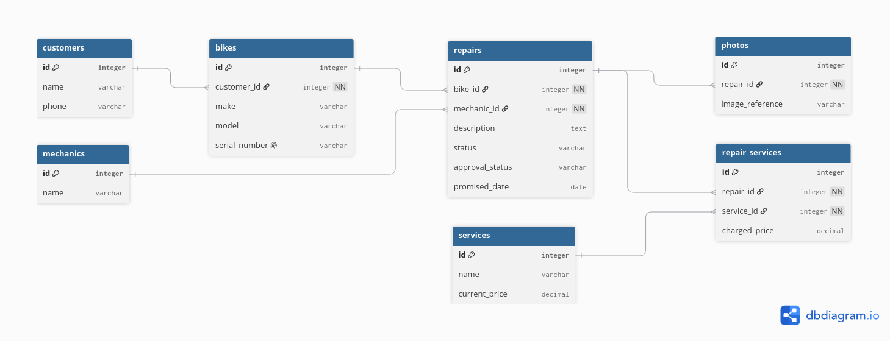

# Domain Model

## Diagram Image



## Diagram Code

```dbml
Table customers {
  id integer [pk, increment]
  name varchar
  phone varchar
}

Table bikes {
  id integer [pk, increment]
  customer_id integer [not null]
  make varchar
  model varchar
  serial_number varchar [unique]
}

Table mechanics {
  id integer [pk, increment]
  name varchar
}

Table repairs {
  id integer [pk, increment]
  bike_id integer [not null]
  mechanic_id integer [not null]
  description text
  status varchar
  approval_status varchar
  promised_date date
}

Table photos {
  id integer [pk, increment]
  repair_id integer [not null]
  image_reference varchar
}

Table services {
  id integer [pk, increment]
  name varchar
  current_price decimal
}

Table repair_services {
  id integer [pk, increment]
  repair_id integer [not null]
  service_id integer [not null]
  charged_price decimal
}

Ref: bikes.customer_id > customers.id
Ref: repairs.bike_id > bikes.id
Ref: repairs.mechanic_id > mechanics.id
Ref: photos.repair_id > repairs.id
Ref: repair_services.repair_id > repairs.id
Ref: repair_services.service_id > services.id
```

## Repair Lifecycle

A repair can go through the following states:

`Received → Assessment → Awaiting Approval → In Progress → Ready → Picked Up`

For simple repairs where the customer can approve the work immediately, the repair may move from `Assessment` to `Awaiting Approval` and then directly to `In Progress` once approval is recorded.

For repairs that require a more detailed assessment, the repair remains in `Awaiting Approval` until the customer is contacted and approves the proposed work.

If the customer declines the repair, the repair moves from `Awaiting Approval` to `Declined`, and then to `Picked Up` without any repair work being performed.

Therefore, the allowed transitions are:

- `Received → Assessment`
- `Assessment → Awaiting Approval`
- `Awaiting Approval → In Progress` when the customer approves the repair
- `Awaiting Approval → Declined` when the customer declines the repair
- `In Progress → Ready`
- `Ready → Picked Up`
- `Declined → Picked Up`

Transitions that skip required steps are not allowed. For example:

- `Received → In Progress` is not allowed because the bike has not been assessed or approved.
- `Assessment → In Progress` is not allowed because customer approval must be recorded first.
- `Awaiting Approval → In Progress` is not allowed unless customer approval has been received.
- `Declined → In Progress` is not allowed because the customer declined the repair.
- `In Progress → Picked Up` is not allowed because completed work must first be marked as ready.
- `Picked Up → In Progress` is not allowed because the repair has already ended and the bike has left the shop.

The `status` attribute records the repair's current lifecycle state. The `approval_status` attribute separately records whether approval is awaiting a response, approved, or declined.

## Entity Justification

| Entity | User stories |
|---|---|
| Customer | US-01 — Bike registration |
| Bike | US-01 — Bike registration; US-02 — Bike identification |
| Mechanic | US-04 — Bike problem description; US-06 — Bike status: workable |
| Repair | US-04 — Bike problem description; US-08 — Bike status: finished |
| Photo | US-03 — Bike photos |
| Service | US-05 — Repairs needed; US-13 — Walllist prices |
| RepairService | US-05 — Repairs needed; US-12 — Flexible pricing |

## The Thing and the Copy of the Thing

My system prevents mixing up two similar bikes because it uses serial numbers as identifiers, which are unique to each bike. As for why a quantity column wouldn't work, the quantity does not give you any useful information regarding a bike's identity, nor is it needed by the company to carry out its function, so it wouldn't only fail to give any useful information about the bike's identity, but also add unnecessary information to the database.

## Derived, or Stored?

In my structure, the fact that a bike is overdue isn't stored as its own column because it can be derived from the promised date, the current date, and repair status.

As for a stored value, the price charged for each repair service is stored because it can differ from the current price for each repair service, given that the store wants to be able to change prices depending on their own criteria, and the prices may change over time due to price increases. This way the price that was agreed upon stays fixed independent of other factors.