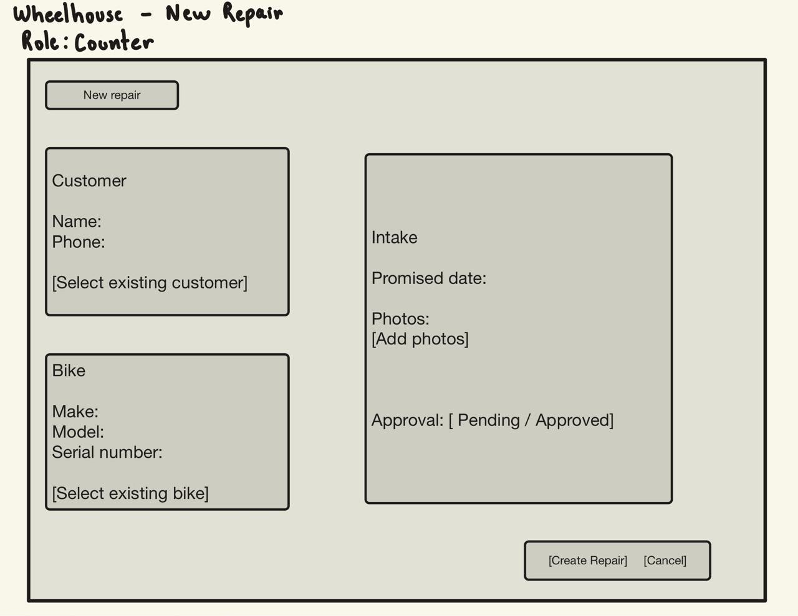
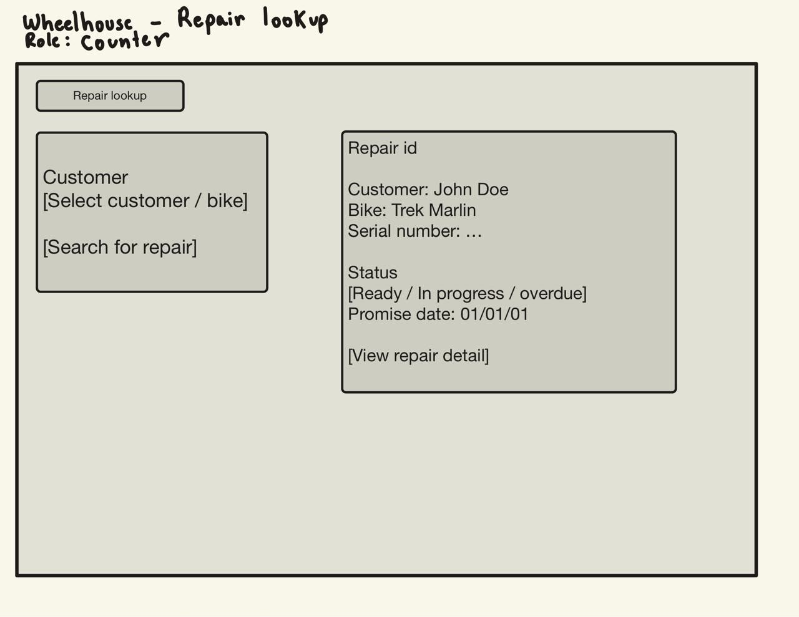
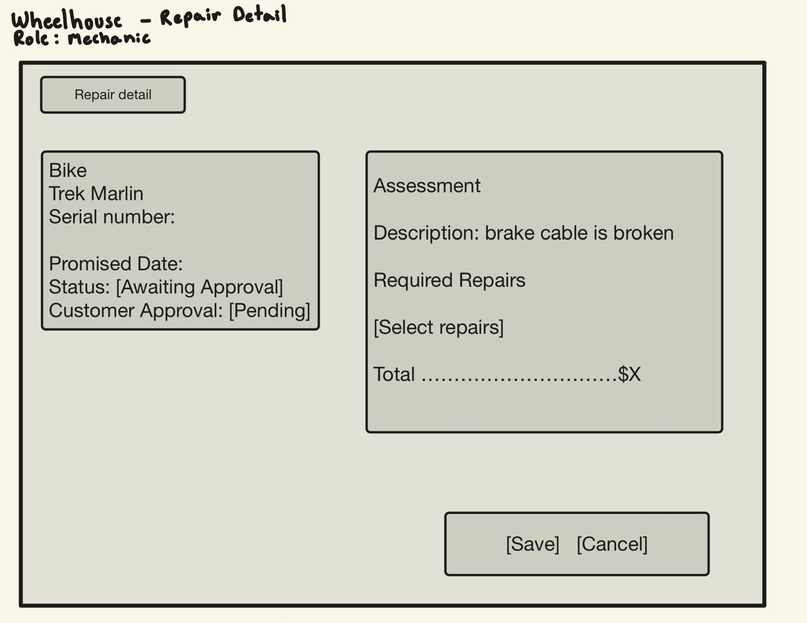
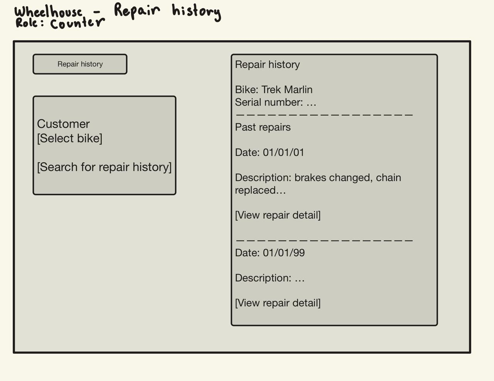
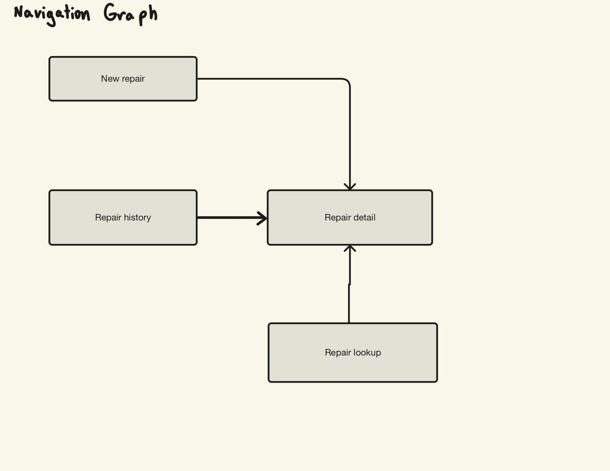

# Wireframes

## New Repair

**Role:** Counter Staff

This screen is used when a bike arrives at the shop. It allows the counter staff member to register or select a customer, register or select a bike, record the promised date, add intake photos, and create the repair.

## Repair Lookup

**Role:** Counter Staff

This screen is used to search for a repair using the customer or bike. It displays the bike, customer, serial number, repair status, and promised date so that counter staff can quickly answer whether a bike is ready.

## Repair Detail

**Role:** Mechanic

This screen is used by a mechanic to view and update the repair. It shows the bike information, promised date, repair status, customer approval status, assessment, required repairs, and total price.

## Repair History

**Role:** Counter Staff

This screen is used to view the repair history of a specific bike. The history is associated with the bike and its serial number rather than only with the customer.

## Navigation Graph

The navigation graph shows how the four screens connect. Each screen can be reached from another screen.